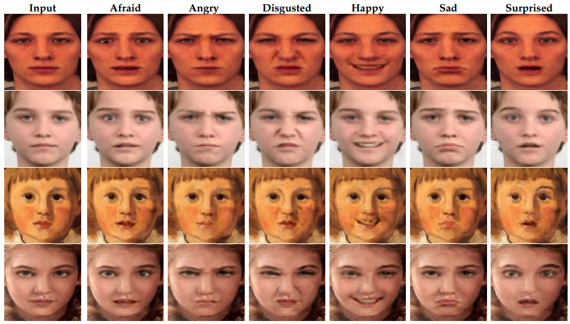

# US-GAN: On the importance of Ultimate Skip Connection for Facial Expression Synthesis

<p align="center"></p>

This repository provides the official implementation of the following paper:
>[US-GAN: On the importance of Ultimate Skip Connection for Facial Expression Synthesis](https://arxiv.org/abs/2112.13002)<br>
> [Arbish Akram](https://arbishakram.github.io/) and [Nazar Khan](http://faculty.pucit.edu.pk/nazarkhan/) <br>
> Department of Computer Science, University of the Punjab, Lahore, Pakistan.<br>
> **Abstract:** *We demonstrate the benefit of using an ultimate skip (US) connection for facial expression synthesis using generative adversarial networks (GAN). A direct connection transfers identity, facial, and color details from input to output while suppressing artifacts. The intermediate layers can therefore focus on expression generation only. This leads to a light-weight US-GAN model comprised of encoding layers, a single residual block, decoding layers, and an ultimate skip connection from input to output. US-GAN has 3x fewer parameters than state-of-the-art models and is trained on 2 orders of magnitude smaller dataset. It yields 7% increase in face verification score (FVS) and 27% decrease in average content distance (ACD). Based on a randomized user-study, US-GAN outperforms the state of the art by 25% in face realism, 43% in expression quality, and 58% in identity preservation.*

## Test with Pretrained Model
```
python driver.py --mode test --image_size 128 --c_dim 7 --image_dir ./testing_imgs/ --model_save_dir ./pre-trained_model/ \
                 --result_dir ./usgan/results                     

```

## Train the Model
```
python driver.py --mode train --image_size 128 --c_dim 7 --image_dir ./dataset/  --model_save_dir ./usgan/models/ --log_dir ./usgan/logs \
                 --sample_dir ./usgan/samples --result_dir ./usgan/results                              
```
